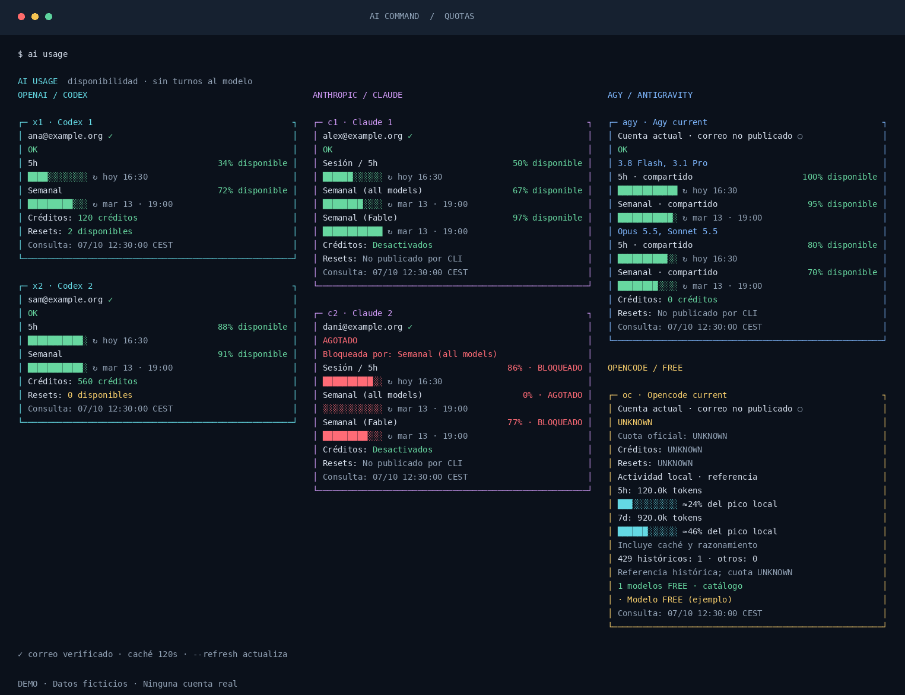

<div align="center">

# AI Command

**Tus cuentas de IA. Una terminal. El mismo proyecto.**

[](https://github.com/tonomolla6/ai-command/actions/workflows/tests.yml)
[](https://github.com/tonomolla6/ai-command/releases/latest)


[](LICENSE)

Gestor local para **Codex CLI, Claude Code, Antigravity y OpenCode**.
Credenciales por cuenta, cuotas en paralelo y continuidad en tu directorio de trabajo.



*Captura del renderizador real con datos ficticios. Las cuotas y créditos dependen de cada proveedor y plan.*

</div>

## Un día con AI Command

```bash
cd ~/proyectos/mi-app
codex                       # mejor cuenta disponible → conversación NUEVA
# … trabajar; Ctrl+D para salir
codex resume ID              # mejor cuenta disponible → esa conversación
ai usage                    # 5h, semanal, créditos y correo de todas las cuentas
ai handoff --task "Terminar el checkout" --remaining "Validar los tests"
claude                      # cuenta disponible → nueva sesión; lee .ai/handoff.md
```

`codex` y `claude` **abren conversaciones nuevas**. Sólo se reanuda cuando lo pides.
El gestor conserva cwd, archivos, rama Git, `AGENTS.md` y `CLAUDE.md`.
Cambiar de cuenta requiere salir del CLI y volver a lanzarlo; la terminal permanece abierta.

## Instalación

Necesitas Linux, Python **3.11+** y los CLI oficiales que vayas a utilizar instalados
en `PATH`. `git` permite instalar desde el repositorio; `fzf` mejora el menú y
`tmux` es opcional para la integración de VS Code. El gestor usa sólo la biblioteca
estándar de Python y funciona en x86_64 y ARM64.

```bash
git clone --branch v1.1.2 --depth 1 https://github.com/tonomolla6/ai-command.git
cd ai-command
./install.sh
export PATH="$HOME/.local/bin:$PATH"  # instalación sin sudo
hash -r
ai setup --empty
```

Sin privilegios se instala en `~/.local`. Para compartir **el código y los comandos**
con todos los usuarios del servidor:

```bash
sudo ./install.sh --prefix /usr/local
```

Cada usuario conserva sus propios perfiles bajo su HOME; instalar globalmente
no comparte sus logins. El instalador conserva los CLI nativos y rechaza sobrescribir
un binario ajeno. Si un CLI ocupa físicamente el mismo destino, usa otro prefijo o
`./install.sh --no-auto`; `ai auto codex` y `ai auto claude` siguen disponibles.

La instalación no actualiza los proveedores. Puedes activar después el mantenimiento
periódico descrito más abajo.
Consulta sus instrucciones oficiales: [Codex](https://developers.openai.com/codex/cli/),
[Claude Code](https://code.claude.com/docs/en/setup), [OpenCode](https://opencode.ai/docs/).

## Añade tus cuentas una vez

```bash
ai add codex ana@example.org --id 1
ai login codex 1
ai add codex sam@example.org --id 2
ai login codex 2

ai add claude alex@example.org --id 1
ai login claude 1
ai add claude dani@example.org --id 2
ai login claude 2
```

Los correos de ejemplo son ficticios. El login lo realiza el CLI oficial; el gestor
verifica el correo y nunca reasigna silenciosamente una credencial a otra cuenta.
Puedes registrar cualquier número de cuentas. Para conservar un login ya existente,
usa `ai add codex TU_CORREO --id 1 --home ~/.codex` o su equivalente para Claude.

| Acción | Comando |
|---|---|
| Menú con fzf o menú estándar | `ai` |
| Cuentas / diagnóstico | `ai accounts`, `ai doctor` |
| Elegir Codex explícitamente | `x1`, `x2`, `ai codex ana@example.org` |
| Elegir Claude explícitamente | `c1`, `c2`, `ai claude alex@example.org` |
| Última conversación de este directorio | `x2r`, `c2r`, `ai resume codex 2` |
| Reanudar un ID concreto | `codex resume ID`, `claude resume ID` |
| Elegir otra conversación | `ai resume claude 2 --pick` |
| Listar IDs sin mostrar conversaciones | `ai sessions codex --all` |
| Dar de baja sin borrar datos | `ai disable codex ana@example.org` |
| Reactivar / renumerar | `ai enable codex 1`, `ai rename codex 1 4` |
| Reservar una cuenta para un modelo verificado | `ai policy codex 1 --model MODELO --auto off` |
| Dejar una cuenta como última opción automática | `ai priority codex 2 low` |
| Recuperar su prioridad habitual | `ai priority codex 2 normal` |
| Elegir una cuenta sólo para este lanzamiento | `ACCOUNT=codex2 codex`, `ACCOUNT=claude2 claude` |
| Reanudar un ID con una cuenta concreta | `ACCOUNT=codex2 codex resume ID` |
| Usar el login actual de AGY / OpenCode | `ai agy`, `ai opencode` |

La prioridad `low` deja una cuenta como último recurso; sigue exigiendo identidad
y cuota positivas. Dentro de cada prioridad se mantiene el orden por reinicio más
cercano. `ACCOUNT` elige sólo para esa invocación y no consulta cuotas ni cambia
de cuenta ante un error. También admite `x2`, `c2`, un número o un correo registrado;
rechaza cuentas desactivadas y selecciones de otro proveedor. Los argumentos
nativos y el directorio se conservan. `--version`, login y otros comandos
administrativos mantienen su comportamiento habitual.

También se crean `claude2`, `codex2` y sus variantes terminadas en `r`.

La selección automática exige identidad correcta y ventanas conocidas con margen.
Primero usa las cuentas con prioridad normal; recurre a las de prioridad baja
cuando las demás no tienen cuota verificada. Dentro de cada prioridad elige el
próximo reset conocido más cercano; después, el mayor margen mínimo.
Una ventana general agotada excluye la cuenta aunque otra ventana tenga saldo.
No cambia cuentas durante una ejecución ni activa compras o créditos de pago.

Al abrir o reanudar, reutiliza la caché oficial de `ai usage` durante un máximo
de 120 segundos. Sólo consulta los perfiles que faltan, caducan o han cruzado
una fecha de reset; no inventa nuevos porcentajes. Si varios lanzamientos llegan
a la vez, uno consulta y los demás reutilizan el resultado. El mensaje indica
cuándo está usando caché. Las cuotas desconocidas, agotadas o con identidad no
verificada siguen excluidas de la selección automática.

Para comprobar las cuotas ahora, usa `ai usage claude --refresh` antes de reanudar,
o `ai auto claude --refresh --resume --session ID`. La cuenta elegida confirma
su identidad de nuevo al ejecutar el CLI.

## Cuotas que se pueden comprobar

```bash
ai usage                    # consulta en paralelo; caché de 120 segundos
ai usage --refresh          # consulta fresca de todas las cuentas activas
ai usage --cached           # sólo caché local
ai usage --json             # datos estructurados para tus scripts
ai usage --monitoring       # panel vivo; actualiza cuotas cada cinco minutos
ai usage codex --monitoring # el mismo panel, sólo para Codex
ai usage codex              # sólo Codex; también claude, agy u opencode
ai usage agy --refresh      # consultar únicamente AGY de nuevo
ai usage --layout stacked   # tarjetas verticales para terminales estrechas
```

Codex, Claude y AGY/OpenCode ocupan tres columnas en terminales anchas. Las tarjetas
incluyen correo verificado, ventanas publicadas, reset, créditos y fecha de consulta.
Una ventana semanal general agotada pone las dependientes en rojo y muestra
`BLOQUEADO`, conservando sus porcentajes originales.

El modo `--monitoring` ocupa la terminal como un monitor de sistema. Mantiene
las tarjetas con colores y columnas, muestra la cuenta atrás y consulta todas
las cuentas seleccionadas en paralelo cada cinco minutos. Las consultas se
ejecutan en segundo plano mientras el panel está abierto; los datos anteriores
siguen visibles hasta que termina la consulta, sin generar turnos al modelo.
Usa `r` para actualizar, `q` o `Ctrl+C` para salir, flechas o rueda para desplazarte
y `PgUp`/`PgDn` para pasar de página. Conserva la pantalla anterior al salir y
adapta el panel al cambiar el tamaño de la terminal. Si una consulta sigue activa,
espera a que termine antes de empezar otra. El modo requiere una terminal
interactiva y admite el filtro de proveedor, `--layout` y `--color`.

`Resets: 2 disponibles` muestra los reinicios manuales que publica la cuenta,
separados del saldo de créditos y de la fecha del próximo reinicio automático.
Codex proporciona el contador mediante su
[protocolo oficial](https://developers.openai.com/codex/app-server/).
Un cero se muestra como `0 disponibles`; un dato ausente aparece como
`No publicado por CLI` o `UNKNOWN` si la consulta falla. Claude Code no publica
ese contador en la versión comprobada: sus resets se consultan en
[Settings > Usage de Claude](https://support.claude.com/en/articles/17007452-what-is-a-limit-reset).
Consultar uso no consume resets ni habilita una cuenta con cuota agotada.

| Herramienta | Fuente de información |
|---|---|
| Codex | Protocolo local oficial de `codex app-server`, `account/rateLimits/read` |
| Claude Code | `/usage` oficial; salida estructurada sin turnos en versiones verificadas y PTY conservador como alternativa |
| Antigravity | Comandos `/usage`, `/credits` y catálogo publicados por el CLI instalado |
| OpenCode | Catálogo gratuito y contadores de su historial local, leído en modo sólo lectura |

`UNKNOWN` significa que el CLI no publicó un dato fiable: no se inventan saldos.
No se usan páginas privadas ni endpoints HTTP internos. Una consulta fallida nunca
presenta un porcentaje antiguo como actual. Las versiones verificadas y los límites
del adaptador se detallan en [compatibilidad](docs/COMPATIBILITY.md).

Las barras de OpenCode son **actividad local aproximada**, frente a un pico histórico
de tokens en 5h/7d; no representan cuota restante. `ai activity opencode` agrupa los
429 por proveedor/modelo, sin inferir presupuestos ni resets. Los modelos FREE se
eligen por el catálogo actual; su disponibilidad sigue dependiendo del proveedor.

## Historial y handoff

Codex mantiene `CODEX_HOME` por cuenta y un `sqlite_home` común mediante su mecanismo
oficial. Claude utiliza `CLAUDE_CONFIG_DIR` y reanuda transcripts por ruta nativa;
no necesita compartir todo su directorio `projects`. Los subagentes Codex no se
ofrecen como conversaciones principales reanudables.

Los goals de Codex pertenecen al hilo. Al reanudar un ID restaurado, el gestor
conserva el índice que contiene su objetivo si ambos índices apuntan al mismo
transcript nativo. No recrea la goal: mantiene presupuesto, tokens, tiempo y estado.
Un conflicto entre objetivos o historiales produce un aviso y conserva los datos.
Una goal pausada o detenida por cuota conserva ese estado; `/goal resume` permite
continuarla desde la TUI tras elegir una cuenta con disponibilidad.

`ai handoff` crea `.ai/handoff.md` con estado Git, resumen de archivos, commits
recientes y tus notas. Incluye secciones para objetivo, trabajo, tests, decisiones
y siguiente paso. No incluye contenido del diff, archivos `.env`, credenciales ni
transcripts; los resultados de tests se documentan sólo si los indicas.
Los siguientes lanzamientos gestionados reciben la instrucción de leerlo.
El gestor añade `.ai/` al ignore local del repositorio.

Si el proveedor rechaza reanudar entre cuentas, el gestor informa y ofrece un
selector o handoff. No convierte bases de conversaciones entre proveedores.

## Permisos de ejecución

Cada proveedor tiene una política de permisos independiente. Para activar las
cuatro en este usuario:

```bash
ai configure --codex-danger on --claude-danger on --agy-danger on --opencode-danger on
```

Codex usa `--dangerously-bypass-approvals-and-sandbox`: ejecuta sin sandbox y sin
solicitar aprobaciones. Se aplica a sesiones nuevas, resume, `exec`, `exec resume`
y `review`, incluidos los atajos numerados y la selección mediante `ACCOUNT`.
Los flags de sandbox/aprobación incompatibles se normalizan; los prompts, el
modelo reservado y los perfiles mantienen su contenido e identidad.

```bash
ai configure --codex-danger on
codex                       # cuenta automática, conversación nueva
codex resume ID             # misma política, conversación solicitada
ai codex 2                  # cuenta explícita
ACCOUNT=codex2 codex exec 'Tu tarea'
ai configure --codex-danger off
```

Es opt-in y está desactivado por defecto en instalaciones nuevas. Cambiar la
política afecta a los siguientes lanzamientos; las sesiones ya abiertas conservan
su modo. Login, ayuda, administración y consultas de cuotas usan el CLI original
sin añadir estos permisos. La opción se ha verificado en Codex CLI 0.161.0.

Una instalación nueva conserva los permisos normales de Claude. Si deseas que
**todos sus lanzamientos gestionados**, incluidos `--resume`, `-r`, `--continue`
y `-p`, utilicen bypass:

```bash
ai configure --claude-danger on
# Para volver al comportamiento normal:
ai configure --claude-danger off
```

Activado, pasa `IS_SANDBOX=1`, `--dangerously-skip-permissions` y
`--permission-mode bypassPermissions` al proceso hijo. No cambia permisos de Linux,
políticas de organización ni reglas deny del proveedor. Las consultas de cuotas
separadas del gestor no reciben estos flags.

AGY y OpenCode también tienen una política explícita, desactivada por defecto:

```bash
ai configure --agy-danger on --opencode-danger on
ai agy                      # --dangerously-skip-permissions
ai resume agy               # mismo modo al reanudar
ai opencode                 # --auto
ai resume opencode          # mismo modo al reanudar
```

OpenCode `--auto` aprueba solicitudes que pedirían confirmación y mantiene las
reglas `deny` explícitas del proveedor, proyecto y agente. Son las opciones
oficiales verificadas en AGY 1.3.1 y OpenCode 1.18.35.
Con su política activada, AGY también descarta un flag `--sandbox` de lanzamiento
incompatible con el acceso completo; no cambia el contenido de los prompts.

Para aplicar la misma política a los comandos directos en Bash, sin mover los
ejecutables ni alterar sus actualizaciones nativas:

```bash
ai install --shell          # bloque gestionado en .bashrc, con backup
source ~/.bashrc            # sólo para cargarlo en la terminal ya abierta
agy
opencode --continue
```

Las funciones pasan los argumentos nativos a `ai native`; no seleccionan modelos
ni cuentas. Las consultas internas de cuotas usan el ejecutable original y no
reciben el flag. Usa `--agy-danger off` o `--opencode-danger off` para desactivarlo.

## Actualizaciones y servidores

Al ejecutar un comando interactivo, el gestor comprueba si hay una release/tag
estable más reciente y pregunta si deseas actualizar. Si aceptas, verifica el
paquete, actualiza y relanza **el mismo comando con sus argumentos y directorio**.
La comprobación tiene un timeout de 2 segundos y una caché de 15 minutos; sin red
continúa trabajando. Las ejecuciones no interactivas, JSON, dry-run y consultas
explícitamente de caché no muestran preguntas. Un tag sin paquete/checksum publicado
no se ofrece como actualización. En instalaciones globales puede pedir sudo.

```bash
ai --version
ai update --check           # ver la última release estable publicada
ai update                   # descargarla, verificarla e instalarla
ai update --to v1.1.2       # fijar una release estable concreta
ai update --list            # versiones conservadas en este servidor
ai update --rollback        # volver a la versión anterior compatible
ai migrate --dry-run        # ver migraciones pendientes, sin aplicarlas
```

En una instalación global usa `sudo ai update`. El gestor descarga el paquete del
tag de una **GitHub Release estable** y comprueba SHA-256 antes de extraerlo.
No instala directamente desde `main`, tags sin release, borradores o prereleases.
Cada release queda en un directorio independiente y se comprueba antes de cambiar
el enlace `current` atómicamente. Las sesiones ya abiertas conservan su proceso.

Las migraciones son numeradas, idempotentes y por usuario, con backup privado
previo; conservan campos desconocidos y rechazan esquemas futuros. Se ejecutan al
usar `ai`, también para usuarios de una instalación global. Los backups contienen
configuración local y **nunca forman parte del paquete**. Los perfiles, tokens,
sesiones, cachés y repositorios no se incluyen en una actualización.

Para otro servidor instala el mismo tag y configura allí las cuentas. Trasladar
logins o historial es una operación privada aparte, explícita y con backup: un
`git clone` o `ai update` no los transporta. Consulta
[el diseño de versiones y migraciones](docs/UPDATES.md) para añadir nuevas funciones.

## Actualización periódica de los CLI

```bash
ai providers-update --check          # inspección sin actualizar
sudo ai providers-update --cron on   # cada 6 horas, en el minuto 17
ai providers-update --cron status
sudo ai providers-update --cron off
```

La tarea usa npm para las instalaciones globales de Codex/Claude, `agy update`
y `opencode upgrade` para las instalaciones restantes. Para binarios Linux
independientes de Codex, Claude y OpenCode descarga la distribución oficial,
verifica su checksum y la versión, y sustituye únicamente el ejecutable nativo.
Admite x86_64 y ARM64 sin instalar Node/npm. Aplaza un proveedor si
tiene procesos activos, usa un lock y conserva backups privados sólo del código,
deduplicados por contenido. Comprueba la versión posterior y restaura el código
anterior si falla la actualización. No toca credenciales, conversaciones ni planes.
Reserva al menos 15 GiB libres y espacio adicional para cada actualización.
Si no hay espacio suficiente, muestra `SKIPPED_SPACE` y vuelve a intentarlo en
la siguiente ejecución; nunca borra datos para hacer sitio.

Los registros están bajo `/var/log/ai-command/`, accesibles sólo por root y con
rotación. No guardan la salida bruta del instalador ni envían correo. Puedes revisar
el último resultado en `~/.local/state/ai-manager/provider-updates.json` o ejecutar
`ai providers-update` manualmente. Este cron es distinto de `ai update`, que sigue
actualizando el gestor desde sus releases verificadas.

## VS Code Remote SSH y skill

La lista Agentes usa dos puntos independientes: actividad a la izquierda y
proveedor a la derecha. Codex es verde, Claude naranja, AGY violeta, OpenCode
amarillo y una terminal normal gris. El proveedor también aparece en texto y
en la información accesible. AGY/OpenCode se identifican por su proceso nativo;
su actividad queda como no confirmada cuando no existe un registro compatible.

```bash
ai vscode-install
```

Incluye **AI Command Agentes** (estado trabajando/terminado/atención) y **AI Command Terminales**
(persistencia con tmux). Ejecuta el comando con el usuario de la conexión Remote SSH
y recarga la ventana. La detección usa perfiles del proceso, sin leer credenciales
ni escribir en otras terminales. El adaptador de orden depende de detalles internos
de VS Code; ante incompatibilidades conserva un estado desconocido.
Después de actualizar las extensiones incluidas, vuelve a ejecutar `ai vscode-install`.
La extensión de terminales incluye su propia pareja de lanzadores y usa una ruta
absoluta: conserva la clave de cada pestaña al recuperar y no depende de otro
comando `terminales` instalado en PATH. Las pestañas que revive VS Code se adoptan;
si llegan después de la recuperación, se cierra sólo el cliente adicional.
VS Code conserva las pestañas y sus grupos Split/Join; tmux conserva los procesos.
Al reconectar se adoptan las pestañas recuperadas y se adjuntan sólo las sesiones
que falten. Una sesión desaparecida muestra un aviso para usar `ai resume`, sin
fabricar otra shell vacía. El arranque no relanza agentes ni cambia la pestaña
seleccionada: Split utiliza la terminal seleccionada.

El renderizado nativo usa control mode con tmux 3.6 o posterior. Los servidores
3.2–3.5 que aún tienen agentes activos usan una conexión `pipe-pane` privada, sin
reiniciarlos ni guardar su salida. Si existe otro pipe, se conserva. Los nuevos
perfiles pueden usar una instancia separada del tmux actualizado. Codex se lanza
con `--no-alt-screen` y Claude con su opción de pantalla alternativa desactivada,
para que funcionen el scroll y la selección normales de VS Code.

Reiniciar VS Code conserva los procesos mientras el servidor sigue encendido.
Reiniciar el servidor termina los procesos: la continuación se hace con el
comando oficial de resume y el historial guardado.

La [skill ai-command](skills/ai-command/SKILL.md) enseña a un agente a dar altas,
consultar uso y administrar versiones mediante estos comandos. Puedes copiar su
carpeta al directorio de skills de tu proyecto.

## Datos locales

| Ruta | Contenido |
|---|---|
| `~/.config/ai-manager/config.json` | Registro privado de cuentas y preferencias |
| `~/.local/state/ai-manager/` | Caché de cuotas, última selección y migraciones |
| `~/.codex-account-N/`, `~/.claude-account-N/` | Perfiles y autenticación independiente |
| `~/.ai-manager/backups/` | Backups privados timestamped |
| `PREFIX/lib/ai-command/` | Código versionado, originales nativos y backups de lanzadores |

El repositorio público y sus releases contienen únicamente código, documentación
y ejemplos ficticios. No tienen acceso a tus cuentas. Los secretos permanecen en
los perfiles de los CLI oficiales; no se escriben en logs del gestor.

## Desarrollo

```bash
python3 -m unittest discover -s tests -q
node --test integrations/vscode/tests/*.test.js
python3 scripts/build_release.py --out /tmp/ai-command-release
```

La prueba gráfica usa tres ventanas reales de VS Code, un HOME temporal y su
propio servidor tmux: comprueba Split, Join, tamaños de paneles, scroll y dos
reinicios sin duplicar terminales. Ejecútala con Node 22+, tmux y Xvfb instalados:

```bash
cd integrations/vscode/terminales-persistentes
npm install --ignore-scripts
npm run test:vscode
```

Los tests no necesitan cuentas ni llamadas al modelo. [CHANGELOG](CHANGELOG.md) ·
[Guía de releases](docs/UPDATES.md) · [Licencia MIT](LICENSE).
